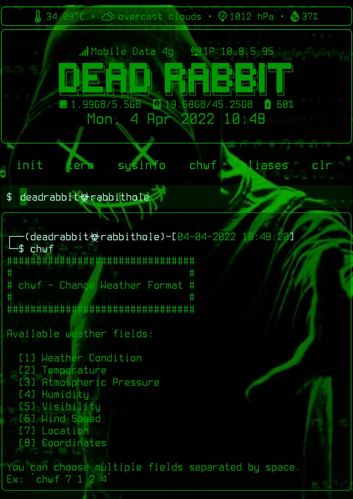

# chwf
Change Weather Format

## Description
A script for T-UI Launcher to easily modify weather format
by letting the user choose what fields to display on the
weather status line.
 

## Features
* Eight weather fields to choose from
* All weather fields have icons

## Installation
**Option 1: Via termux**
* `apt update && apt install -y git`
* `git clone https://github.com/deadrabbit404/chwf.git`
* `cd chwf && bash setup.sh`
* Restart t-ui when setup is done.

**Option 2: Via manual download**
* Download [latest release](https://github.com/deadrabbit404/chwf/releases/tag/v0.1.1)
of chwf and extract it to your internal storage.
* On t-ui launcher, change directory to the
extracted folder.  
Example: `cd chwf-0.1.1`
* Type `sh setup.sh`. Then `restart` t-ui when
setup is done.

## Running the script
To execute the script, just type `chwf`. For more info, type
`chwf -h` to print help message.

## Themes
Looking for cool themes like the one in the image above? Visit
[M4dGun's t-ui themes](https://github.com/M4dGun/t-ui_themes)
repository. It's a  collection of the best themes for
T-UI and T-UI Expert Launcher made by the community.
